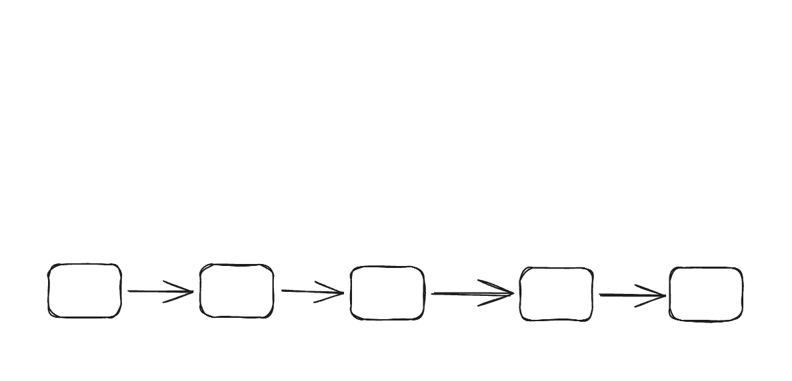
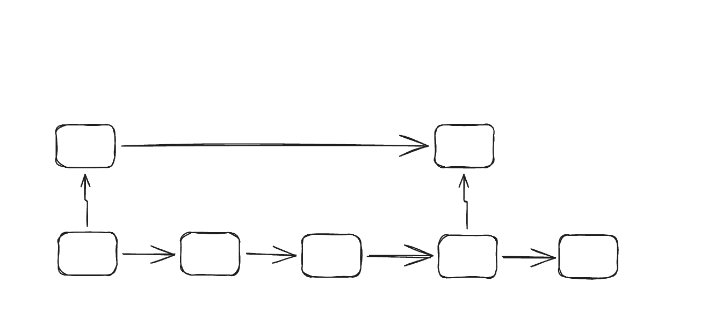
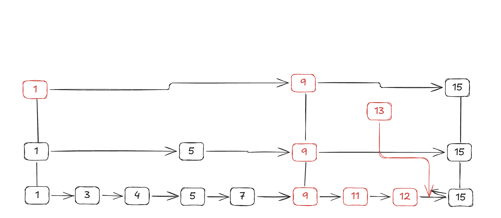

# 内容表
## CMake构建项目
### CMake工作原理
CMake可以看作是一个资源管理器，也是一个介于项目于编译器沟通的中间件。我认为和Maven中的.xml很类似。提前申明项目结构，申明项目依赖关系，让编译器准确识别完成一键编译。
### GCC环境配置及CMake安装
首先，在Windows平台，由于原生不带gcc，所以需要提前下载好WinGW64。将之加入环境变量。下载CMake，在安装时将CMake加入环境变量以便VSCode插件识别。我准备直接使用VSCode中的CMake插件，有一个UI界面可以点击完成构建和编译。
### CMake配置
在构建项目之前，先配置CMake，VSCode插件比较方便，可以一键搜索配置。在配置栏或者第一次启动时，点击【扫描工具包】即可完成配置：
```
[proc] 正在执行命令: E:\MinG-W64\mingw64\bin\gcc.exe -v
[proc] 正在执行命令: E:\MinG-W64\mingw64\bin\x86_64-w64-mingw32-gcc-15.1.0.exe -v
[proc] 正在执行命令: E:\MinG-W64\mingw64\bin\x86_64-w64-mingw32-gcc.exe -v
[proc] 正在执行命令: E:\MinG-W64\mingw64\bin\mingw32-make.exe -v
[proc] 正在执行命令: E:\MinG-W64\mingw64\bin\mingw32-make.exe -v
[proc] 正在执行命令: E:\MinG-W64\mingw64\bin\x86_64-w64-mingw32-gcc.exe -v
[proc] 正在执行命令: E:\MinG-W64\mingw64\bin\mingw32-make.exe -v
[kit] 已找到工具包(受信任): GCC 15.1.0 x86_64-w64-mingw32
[kit] 已找到工具包(受信任): GCC 15.1.0 x86_64-w64-mingw32
[kit] 已找到工具包(受信任): GCC 15.1.0 x86_64-w64-mingw32
[kit] 已成功从 C:\Users\LIU\AppData\Local\CMakeTools\cmake-tools-kits.json 加载 2 工具包
```
说明配置已完成，实际上就是从环境变量中提取gcc编译器位置，然后执行命令。

在这个插件中，还可以看到生成（build）、测试等，都可以做到点击即使用，比自己调出终端然后敲击CMake -build方便一些。

### CMakelists.txt的完成
我们的项目目前来看功能比较少，比较简单，所以CMakelists.txt也比较。我这边仍然先采用AI给出的模板。
```CMake
# ==========================================
# 1. 基础设置
# ==========================================
cmake_minimum_required(VERSION 3.10)
project(DataBase VERSION 1.0)

# 设置输出目录（让生成的 exe 放在 bin 文件夹里）
set(CMAKE_RUNTIME_OUTPUT_DIRECTORY ${CMAKE_BINARY_DIR}/bin)

# ==========================================
# 2. 查找第三方库 (以 OpenCV 为例，可选)
# ==========================================
# find_package(OpenCV REQUIRED)

# ==========================================
# 3. 配置头文件和源文件
# ==========================================
# 自动搜索 src 目录下所有的 .cpp 文件
file(GLOB_RECURSE SOURCES "src/*.cpp")

# 让 CMake 知道去哪里找 .h 头文件
include_directories(include)

# ==========================================
# 4. 生成目标
# ==========================================
# 创建可执行程序
add_executable(${PROJECT_NAME} ${SOURCES})

# ==========================================
# 5. 链接库
# ==========================================
# 如果有第三方库，在这里链接
# target_link_libraries(${PROJECT_NAME} ${OpenCV_LIBS})

# 如果你自己写了库文件，也可以这样链接
# target_link_libraries(${PROJECT_NAME} my_custom_lib)
```
然后在src中创建一个test文件夹，里面新建一个文件`test.cpp`，敲上HelloWorld后使用CMake生成。这时候发现更目录下出线了一个build目录，里面有一个bin即我们test1.exe存放的地方（也可以指定别的名称）。点击运行即可执行。
```txt
PS C:\Users\LIU\Desktop\Project\Database\build\bin> ."C:/Users/LIU/Desktop/Project/Database/build/bin/DataBase.exe"
hello world
```
之前的CMake文件是CMakelists，codex建议改为CMakeLists的命名方式。这边采取。

### 内存&跳表
跳表是一种基于概率的数据结构。可以看作是多条链表上下连接而成。

我们知道，链表这个数据结构拥有O(1)的插入效率，通过多层稀疏索引，把查找、插入、删除都做到期望，做到O(logn)的时间复杂度。

这样的效率足以与红黑数、B+树等复杂数据结构媲美。所以跳表也是被了LevelDB,redies等数据库使用。

#### 实现
维护多跳链表是非常简单的：当数据量小的时候，我们先维护一个底层链表，遍历位置将元素插入。

在每次插入新节点时，直接用随机高度决定它出现在哪几层。

我们将这些元素标上具体的值，然后再多建几层，然后模拟如果我们需要插入一个新元素的情况：

（这边更正一下，层级间使用双向连接，这边使用直线。）
LevelDB 的实现是“一个节点带多层 forward[] 指针数组”。

当插入13这个元素时，会从顶层索引开始，当遇到下一个节点>当前值，则到下面一层。然后继续横向比较即可。

至于删除元素，也是从顶层开始向下找，记录前驱，找到目标后再自底而上的删除。

比如删除9，那么先从上到下找到9，然后删除最底层的9，如果9有二级索引，则删除第二层的...直到他没有"上指针"。

这边讲完了使用方式，那这个上索引到底怎么建立了？这边用了一个非常简单的实现方式：概率。当插入一个元素时，利用随机数判定，设置1/2或者1/4的概率让其向上创建索引。那么上面层实际上又新增了元素，于是再次使用概率判定。如此往复。

在使用跳表作为存储数据结构时，容易出现缓存局部性不佳、空间开销偏大、层数设计不合理、以及是否要引入二级索引等问题。这边解释一下这几个问题，并给出当前项目阶段适合采用的方案：

1. **缓存命中：** 由于链表节点通常是动态创建的，如果直接使用 `new`，节点可能分散在堆上的不同位置。这样在遍历跳表时，CPU 需要不断跟随指针访问较为离散的内存区域，不利于缓存命中和页访问局部性。
    - **解决方案** 参照 LevelDB 等实现，使用 Arena 内存池来分配节点。Arena 会预先申请较大的内存块，并在其中顺序分配空间。这样虽然不能保证节点严格连续，也不能保证一定命中某一级缓存，但通常可以减少内存碎片和分配开销，使同一张 MemTable 中的节点更集中在相邻内存页内，从而改善缓存和 TLB 的整体表现。
        - TLB（Translation Lookaside Buffer，旁路转换缓冲）是计算机系统中的一个硬件组件，用于加速虚拟地址到物理地址的转换过程。它是一个高速缓存，其访问速度远快于主存。
    - 这里还要区分 **Arena** 和 **MemTable**：Arena 是节点的内存分配方式，MemTable 则是一张正在服务写入的内存表。在当前设计中，可以让每个 MemTable 绑定一个 Arena，并为 MemTable 设定近似内存阈值。比如暂定为 64MB，当当前 Mutable MemTable 接近该阈值时，就将其冻结为 Immutable MemTable，后台刷盘生成 SSTable；刷盘完成后，再连同其 Arena 一起回收。
2. **空间占用过多查询效率不足** 这类问题主要是由跳表层数过多引发。一个指针占用8字节的空间(8B)，如果有一个64层的跳表，那么光是64层的节点，指针开销就到了512B，0.5KB。并且查找效率低下：因为竖向遍历的时间开销就足够大。  
   - 采用1/4概率来增加层数，并且出于数据数量，限制层数为8层，让这个跳表足够扁平，至于MemTable大小，我认为暂定为64MB。
3. **二级索引开辟困难** 二级索引本身并不是跳表的必备能力，而是构建数据库时额外增加的一套索引系统。它会明显提高写入路径、数据一致性、恢复逻辑和磁盘组织的复杂度。
   - 在 LevelDB 这一类 LSM 引擎中，系统默认维护的是主键全局有序的 key-space，而不是内建一套通用二级索引。`WriteBatch` 的作用是把多条写操作打包并原子提交，解决的是“这些写入要么同时成功，要么同时失败”，而不是“自动提供二级索引能力”。
   - Redis 中的 `ZSET` 是其特定数据结构，常见实现是字典加跳表，它适合按 score 做范围查询，但不能直接等同于通用数据库中的二级索引方案。
   - 因此，对当前项目来说，更合理的做法是：**第一阶段只实现主键 KV 存储**，先把 SkipList、MemTable、WAL、SSTable 和基础查询路径做稳定；二级索引暂不纳入核心架构，后续如有需要再单独设计。
### 磁盘 
可以说明确了跳表，就明确了数据在内存中的流转方式。现在我们将目光放入磁盘。
#### SSTable
SSTable(Sorted String Table)。当当前 MemTable 达到设定阈值后，我们将其冻结为 Immutable MemTable，然后顺序遍历其中的有序数据并刷到 disk 中，得到的完整磁盘表就是 SSTable。这里要注意，触发刷盘的是 **MemTable 的大小策略**，而不是“Arena 是否真的分配到一滴不剩”。如果不对这些 SSTable 进行进一步组织和管理，当我们需要在磁盘中查找数据时，就可能需要遍历多个表；即使我们维护每个表的 key 范围，表范围之间在某些层级上仍然可能重叠。所以关于这些 SSTable，我们后续还需要继续设计其管理与合并方式。
#### WAL(Write-Ahead-Log)
磁盘中应该维护一个 WAL。当系统异常退出时，尚未刷入 SSTable 的内存数据可以通过 WAL 恢复。WAL 更准确地说是一份**追加写日志**：写操作先顺序追加到 WAL，再更新 MemTable；当系统重启时，只需要重放最近尚未完成持久化的一段日志，就可以把对应数据重新恢复到 MemTable 中。它不应简单理解为一个“入队出队”的队列；更合理的理解是，随着 MemTable 刷盘完成，和它对应的旧日志可以被标记为可删除或回收。
#### BloomFilter
BloomFilter：布隆过滤器，用于确认已落盘的表SSTable中一定不存在某个key的一个工具。是各家使用lsm架构的数据库绕不开的东西。我暂时还没有将之研究透彻，大致讲一下工作原理：
   - 当我们将冻结的表腾到disk中时，需要遍历所有表中的所有数据。我们维护一个Bit数组，并且将key给三个不同的hash得到三个值，然后将数组中的这三个索引标记为1。
   - 这边bit数组大小，以及哈希的数量都是有讲究的，有专门的数学公式。我们留着后续再说。总之业界有成熟的计算方式。
   - 当查询时，只需要将该key hash后得到的值放入数组中比较即可判定出一定不存在与可能存在这两种。至于为什么不能笃定，是因为哈希冲突的原因，并且该哈希冲突是一定存在的，不过能用上述说到的公式控制其发生的概率。那当BloomFilter返回可能存在时就得遍历，如果没有（可能存在但不存在的概率（假阳性率（False Positive Rate, 简称 FPR）），使用1.25B的bit数组，大概在1%）就得继续遍历下一个SST。

为了处理这些SSTable，学术界、工业界可谓是百花齐放。有各种方式，但我们还是使用最容易理解的归并排序的方法。

#### 合并
在磁盘中，各家（使用lsm架构）数据库都绕不开SSTable的处理即合并。比如LevelDB，就是使用分级+BloomFilter+多路归并排序进行处理。

LevelDB按照如下逻辑进行分级：
   - L0级别为刚刚从内存中取出的，没有排序的SSTable集合，L1、L2、L3...都是排完序的。采用10倍为一个量级，比如L0占10MB，L1为100MB...当遇到容量超过当前级别额定容量，这边会随机选取一个SST，然后到下一个量级中（有序SST集合）找到与当前选取的SST有重叠的SST，进行合并。
